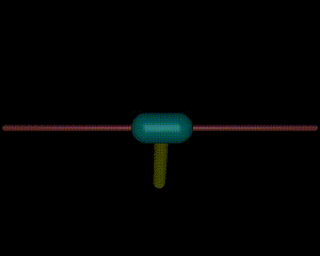
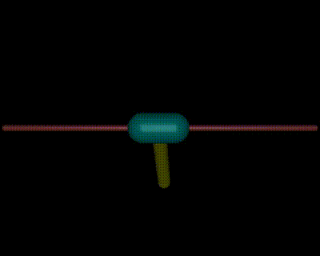

# requirements：

todo.

# Task1-biped

文件处于目录`task1_state_estimation`下。这一节的描述中，若没有特殊说明，我们都假设您在该文件目录下。

# Task2 - RL

文件处于目录`task2_reinforcement_learning`下。这一节的描述中，若没有特殊说明，我们都假设您在该文件目录下。

* 模型

我们的RL代理模型全部**基于pytorch手动实现**，位于目录`agents`包中。我们的模型支持`cuda`，在调用模型时，我们部分模型使用了cuda。如果您**没有何以使用的GPU**，请手动将`cuda`改为`cpu`。通常，我们只在外部调用模型的构造器参数中，传入了`device='cuda'`，例如：

```python
agent = tools.A2CAgent(obs_space_dims, action_space_dims, lr=0.000, gamma=0.99, device = 'cuda')
```

将`device = 'cuda'`更改为`device = 'cpu'`就能解决没有GPU带来的问题。

## 一阶倒立摆

### 稳摆

* 演示

首先是一阶倒立摆的稳定。在`inverted_pendulum/stable_showing.py`中，展示了我们使用A2C算法进行稳定的一阶倒立摆。

### 起摆

在`inverted_pendulum/swingup_train.py`中，提供了我们训练“装杆起摆”策略的一阶倒立摆起摆算法的实现方法。

* 演示

在在`inverted_pendulum/swingup_stable_showing_cv.py`中，我们提供了连续10段使用模型进行的6秒起摆和稳定的仿真，丝滑又流畅；在`inverted_pendulum/swingup_stable_showing_mj.py`中，我们提供了一段使用模型进行的持续45秒的起摆和稳定的仿真，流畅又丝滑。

静止状态起摆：



噪声状态的起摆：



## 二阶倒立摆

### 稳摆

在`inverted_douoble_pendulum`中，我们提供了`idp_training.py`和`idp_showing.py`文件。前者用于训练二阶摆，后者用于显示二阶摆。

最后，祝助教哥哥**天天开心, GPA+++++,PAPER全中一区，老板评上院士**！