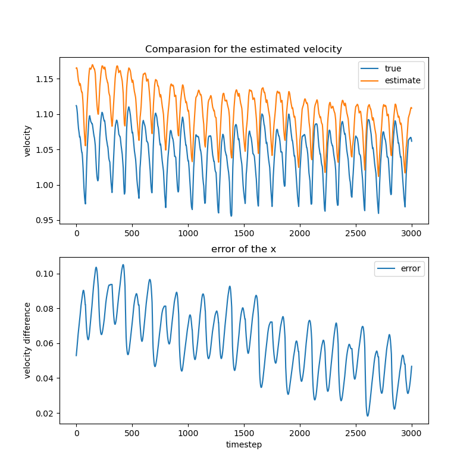
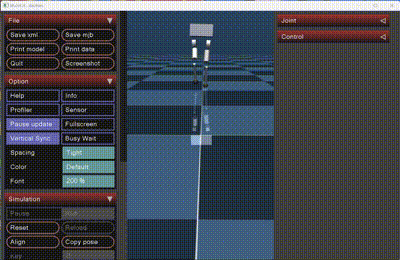
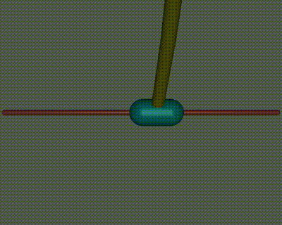

# requirements：

见`requirements.txt`

# Task1-biped

文件处于目录`task1_state_estimation`下。这一节的描述中，若没有特殊说明，我们都假设您在该文件目录下。

我们提供了三个代码文件。

`biped_robot_sim.py`：使用DH表对二足机器人进行的状态估计。改代码经过屎山堆砌之后，我们也不知道为什么不能运行了2333，相信我们它以前真能走。

`biped_robot_sim_r.py`：能够正常运行的二足机器人。观测方差较大（R远大于Q），即这个代码里我们更倾向于使用IMU。

`biped_robot_sim_rec.py`：能够正常运行的二足机器人。观测方差较小（R近似于Q）。这个代码更倾向于使用机器人运动学进行计算的通过机器人足部关节运动规律计算得到的机器人线速度。

* 演示

不管使用大观测方差（R远大于Q，倾向于使用IMU）或者小观测方差（R较小，近似于Q，倾向于使用机器人运动学进行线速度估算），机器人都能正常行走。二者的仿真结果存在轻微差异。详细参考演示视频。

这里我们提供一组小观测误差（R矩阵值小，近似于Q）下的演示，分别是x方向速度误差和机器人运动的部分视频。






# Task2 - RL

文件处于目录`task2_reinforcement_learning`下。这一节的描述中，若没有特殊说明，我们都假设您在该文件目录下。

* 模型

我们的RL代理模型全部**基于pytorch手动实现**，位于目录`agents`包中。我们的模型支持`cuda`，在调用模型时，我们部分模型使用了cuda。如果您**没有何以使用的GPU**，请手动将`cuda`改为`cpu`。通常，我们只在外部调用模型的构造器参数中，传入了`device='cuda'`，例如：

```python
agent = tools.A2CAgent(obs_space_dims, action_space_dims, lr=0.000, gamma=0.99, device = 'cuda')
```

将`device = 'cuda'`更改为`device = 'cpu'`就能解决没有GPU带来的问题。

* 模型简介

我们基于pytorch，手动实现了：

> Q Learning
>
> DQN
>
> A2C
>
> DDPG
>
> PILCO

在`agents`包中。里面包含了一些详细的参数和函数的注释。

## 一阶倒立摆

### 稳摆

* 演示

首先是一阶倒立摆的稳定。在`inverted_pendulum/stable_showing.py`中，展示了我们使用A2C算法进行稳定的一阶倒立摆。

### 起摆

在`inverted_pendulum/swingup_train.py`中，提供了我们训练“装杆起摆”策略的一阶倒立摆起摆算法的实现方法。

* 演示

在在`inverted_pendulum/swingup_stable_showing_cv.py`中，我们提供了连续10段使用模型进行的6秒起摆和稳定的仿真，丝滑又流畅；在`inverted_pendulum/swingup_stable_showing_mj.py`中，我们提供了一段使用模型进行的持续45秒的起摆和稳定的仿真，流畅又丝滑。

静止状态起摆：


噪声状态的起摆：


## 二阶倒立摆

### 稳摆

在`inverted_douoble_pendulum`中，我们提供了`idp_training.py`和`idp_showing.py`文件。前者用于训练二阶摆，后者用于显示二阶摆。

* 演示




### 起摆

返回`finpro`文件夹，`RL_train_swing_d_p_throw`、`stable_inverted_double_state2`、`stable_inverted_double_state3`是我们对起摆的一些尝试。

## 其它

我们在两个倒立摆模型中的`tools`包下，将：

```python
project_root = os.path.abspath(os.path.join(os.path.dirname(__file__), '../../'))
sys.path.append(project_root)
```

即文件夹`task2_reinforcement_learning`设置为了相对工作空间。因此在您的`tools/__init__.py`中，出现的有关于`util`和`agents`的导入爆红，请忽略。

最后，祝助教哥哥**天天开心, GPA+++++,PAPER全中一区，老板评上院士**！