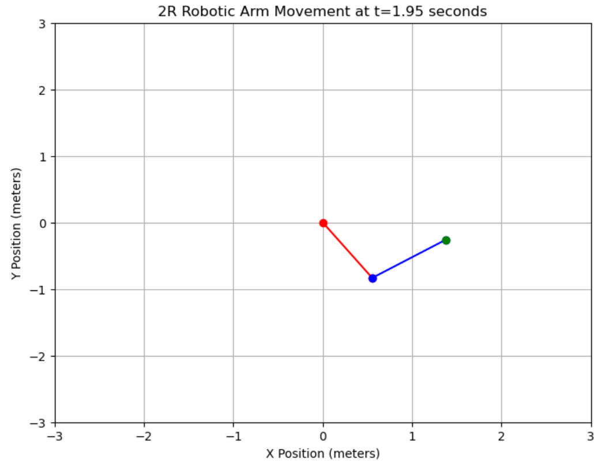
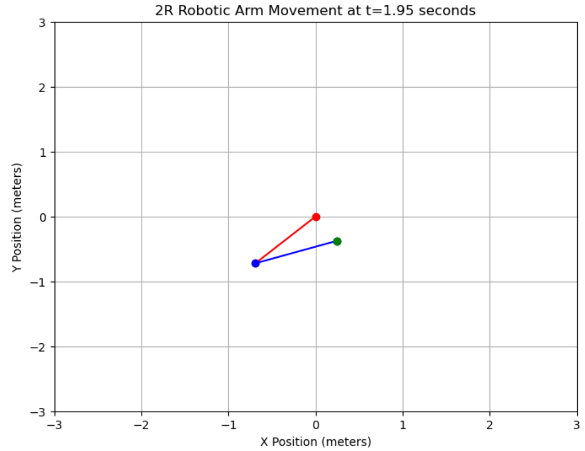

# Robot Dynamics Simulation and Parameter Indentification

## Q3 

（1）

According to the equation, we get:
$$
\ddot \theta={M(\theta)}^{-1}(\tau-c(\theta,\dot\theta)-g(\theta))
$$
Let's assumu:
$$
x=
\begin{bmatrix}
\theta_1\\\theta_2\\\dot \theta_1\\\dot \theta_2
\end{bmatrix}=
\begin{bmatrix}
x_1\\x_2\\x_3\\x_4
\end{bmatrix}
$$
It is easy to get:
$$
\begin{bmatrix}
\dot x_1\\\dot x_2
\end{bmatrix}=
\begin{bmatrix}
\dot \theta_1\\\dot \theta_2
\end{bmatrix}=
\begin{bmatrix}
x_3\\x_4
\end{bmatrix}
$$
and:
$$
\begin{bmatrix}
\dot x_3\\\dot x_4
\end{bmatrix}=
\begin{bmatrix}
\dot \theta_3\\\dot \theta_4
\end{bmatrix}={M(\theta)}^{-1}(\tau-c(\theta,\dot\theta)-g(\theta))
$$
Thus we get the state function:
$$
\dot x=
\begin{bmatrix}
\dot x_1\\\dot x_2\\\dot x_3\\\dot x_4
\end{bmatrix}=
\begin{bmatrix}
x_3\\
x_4\\
M(\theta)^{-1}(\tau-C(\theta,\dot \theta)-g(\theta))
\end{bmatrix}
$$
or we can write as:
$$
\dot x=f(x, \tau)
$$
In descrete time domain, we know:
$$
x[k+1]-x[k]=f(x[k],\tau[k])\cdot T
$$
That is:
$$
x[k+1]=
\begin{bmatrix}
x_1[k+1]\\x_2[k+1]\\x_3[k+1]\\ x_4[k+1]
\end{bmatrix}=
\begin{bmatrix}
x_1[k]+x_3[k]\cdot T\\
x_2[k]+x_4[k]\cdot T\\
M(\theta)^{-1}(\tau-C(\theta,\dot \theta)-g(\theta))\cdot T+
\begin{bmatrix}
x_3[k]\\x_4[k]
\end{bmatrix}
\end{bmatrix}
$$
and:
$$
y[k] = x[k]
$$
In the following simulation, the value of $T$ will be 0.001.

（2）

Apply the method we mentioned in (1) in descrete time domain, we succeffully applyed it in jupyter notebook.

（3）

* Identification Analysis

The system seems to be non-linear. In order to apply least square method, we're going to rectify the system:
$$
\tau=M(\theta)\ddot \theta +c(\theta,\dot\theta)+g(\theta)\\
=Ha
$$
with:
$$
H = \begin{bmatrix}
\ddot\theta_1,~\cos(2\ddot\theta_1+\ddot\theta_2)-\sin\theta_2(2\dot\theta_1\dot\theta_2),\ddot \theta_1+\ddot \theta_2,g\cos(\theta_1),g\cos(\theta_1+\theta_2)\\
0,\cos\theta_2\cdot\ddot\theta_1+\sin\theta_2\cdot\dot\theta_1^2,\ddot \theta_1+\ddot \theta_2,0,g\cos(\theta_1+\theta_2)
\end{bmatrix}
$$
and
$$
a=\begin{bmatrix}
m_1L_1^2+m_2L_1^2\\
m_2L_1L_2\\
m_2L_2^2\\
(m_1+m_2)L_1\\
m_2L_2
\end{bmatrix}=
\begin{bmatrix}
a_1\\a_2\\a_3\\a_4\\a_5
\end{bmatrix}
$$
So we can use $\tau$ and $H$ to estimate $a$:
$$
\hat a = (H^TH)^{-1}H^T\tau
$$
Sometimes, $H^TH$ may be singular, so we can also use pseudo inverse to solve the problem:
$$
\hat a = H^+\tau
$$
Where $H^+$ represents the pseudo-inverse of $H$​.

* Result Examing

To examine the result, we use MSE function:
$$
err = (a-\hat a)^2
$$
where $a$ is the real value of parameter set and $\hat a$ is the predicted parameter set.

Where we know,
$$
L_2 = \frac{a_3}{a_5}\\
m_2=\frac{a_5}{L_2}\\
L_1=\frac{a_2}{m_2L_2}\\
m_1=\frac{a_4}{L_1}-m_2
$$
Given $\tau=[2,1]^T$ as constant outerier torque, using $m_1, m_2=1kg,~L_1=L_2=0.5m$ as simulating parameters, and apply the method to perform least square method, we get:

|       | True Value | Predict Value |
| :---: | :--------: | :-----------: |
| $m_1$ |    1.00    |     1.00      |
| $m_2$ |    1.00    |     1.00      |
| $L_1$ |    0.50    |     0.50      |
| $L_2$ |    0.50    |     0.50      |

with error on parameters to be $9.52\times10^{-5}$.