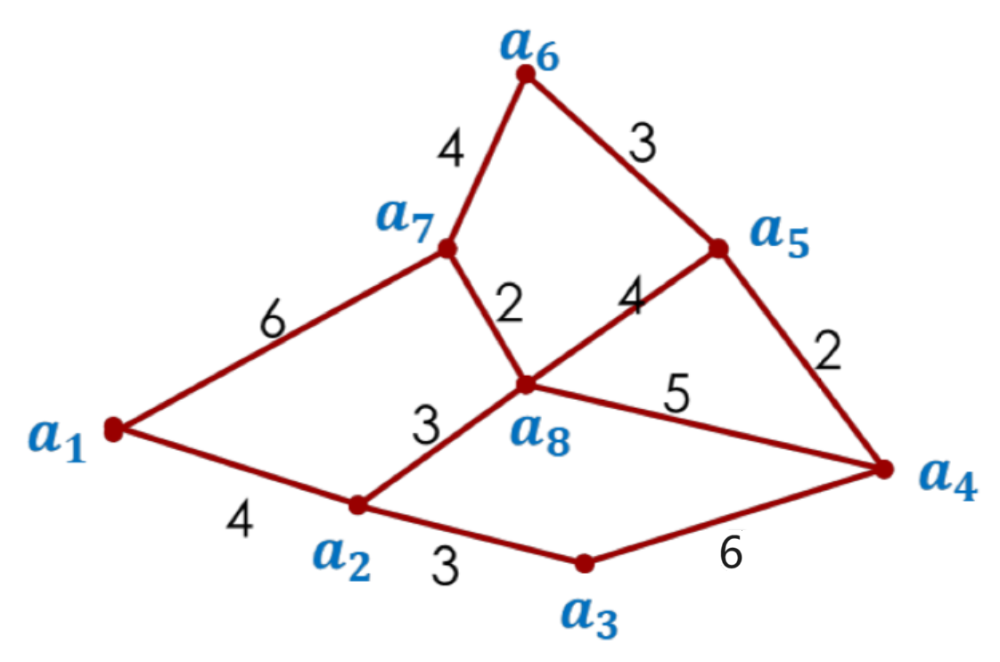
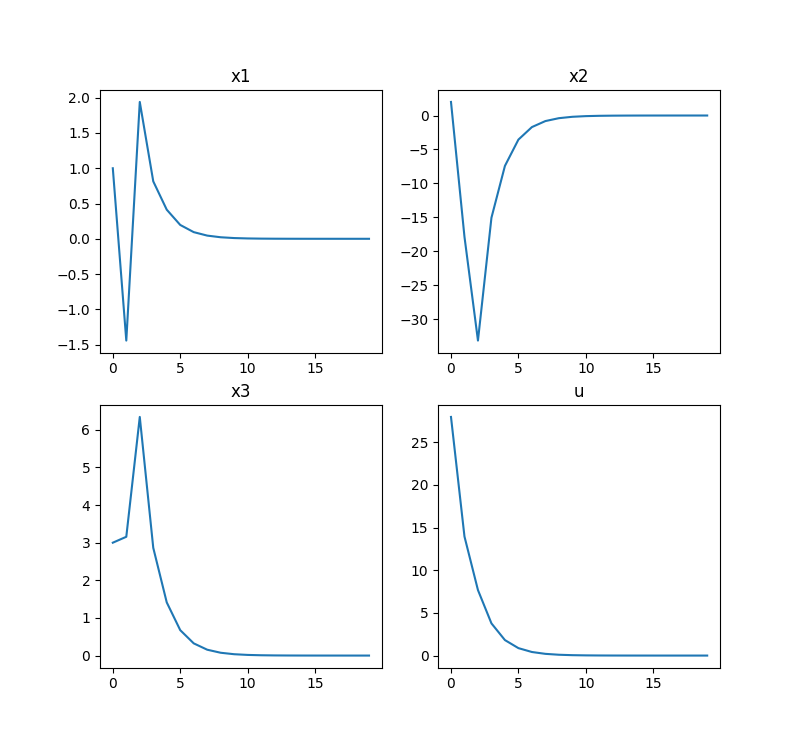
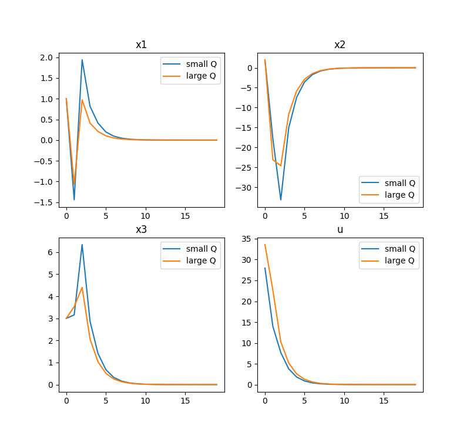

# Lecture Codes - 高仿张巍的代码dddd

课程代码的高仿版本。

3.？？（）记不清楚了：高仿了张巍课程中的rnn代码。`sdm_rnn`

3.24：高仿了张巍课程中regressor的代码，实现了一个简单的线性回归模型。`regressor`

4.9：高仿了张巍课程中，path-planning和lqr的代码。`pathplaining` and `lqr`

数学公式不能显示？提供[pdf版本](readme.pdf)

# RNN

# Regressor

# Path Planning

## Optimal Control Problem

<p align='center'><font size=5><b>Notation</b></font></p>

|    abbr.     |                         |                   备注                   |
| :----------: | :---------------------: | :--------------------------------------: |
| $l(x_k,u_k)$ |  running cost function  |                 步开销。                 |
|   $V_j(z)$   | minimized cost function |        被最小化之后的代价函数值。        |
|   $g(x_N)$   | ternimal cost function  | 终端代价函数，即结束的时候，对应的开销。 |
| $J_N(x_0,u)$ |     N-horizon cost      |    目标函数。我们需要将它进行最小化。    |
|     $x$      |                         |                                          |
|     $u$      |                         |                                          |

在张巍的课堂中，我们学习了：
$$
J_N(x_0,u)=g(x_N)+\sum_{k=0}^{N-1}l(x_k,u_k)\tag{3-1}
$$

我们要做的是，最小化我们的**目标函数**。

在张巍老师的课堂上，其提出了这样几个问题：


现在以Path-planning问题，作为一个例子，来引入对这个问题的解答。（注意，原来课件中，$a_3$到$a_4$的距离是5，在这里为了稍后方便讲解，我将其改为了6）



现在，我希望，从$a_1$走到$a_4$的最短路径。

最开始的状态，我们只知道相邻两点间的距离，而不相邻两点间的最短距离我们暂时不知道。现在我们假设Running cost用来表示：$l(z,u)$代表着z到u点的最短距离。如果没有遍历到，默认设置为$\infty$。

最终状态，我们假设，到了我们的目标点的时候，直接代价设为0，否则成本为$\infty$。即：
$$
g(z)=\begin{cases}
0,~if~z=a_4\\
\infty,~else
\end{cases}\tag{3-2}
$$
因而，我们的目的变成了，求取$J_N(x_0,u)$的最小值的时候，对应的各参数值。

## Dynamic Programming (动态规划)

事实上，如果将我们的函数进行进行“动态步骤移动”，具体到这道题目，假如每次我们都更新一轮到$a_4$点每个点最小距离（每次只走一步，这里的一步是指基于已经知道到$a_4$距离最近的点，更新其相邻点到$a_4$的距离。例如，第一步更新了$a_3~a_5~a_8$到$a_4$的距离，第二步更新$a_2$到$a_3$，$a_6$到$a_5$，$a_2~a_7$到$a_8$的距离，从而可以更新$a_2~a_6~a_7$到$a_4$的最短距离，将这样的距离保存下来，同时**更新其对应的“下一步”**。），这样的思想叫做动态规划（例如*式3-4*就是一种常见的动态规划思想，从第$i$步迭代到第$i+1$步，以此类推）。

例如：

<p align='center'>表3-1 动态规划迭代示例</p>

| 迭代次数 | $a_1/next$ | $a_2/next$ | $a_3/next$ | $a_4 /next$ | ...  | $a_8/next$ |
| :------: | :--------: | :--------: | :--------: | :---------: | :--: | :--------: |
|    0     | $\infty/?$ | $\infty/?$ | $\infty/?$ |   $0/a_4$   |      | $\infty/?$ |
|    1     | $\infty/?$ | $\infty/?$ |  $6/a_4$   |   $0/a_4$   |      |  $5/a_4$   |
|    2     | $\infty/?$ |  $8/a_8$   |  $6/a_4$   |   $0/a_4$   |      |  $5/a_4$   |
|    3     |  $12/a_2$  |  $8/a_8$   |  $6/a_4$   |   $0/a_4$   |      |  $5/a_4$   |

> `$a_i/next$表示$a_i$到$a_4$的最短距离，以及它到$a_4$最短距离时候下一步的点。

现在，让我们接着使用张巍老师的思路，以**最优**的思路来解决这个问题。
$$
J_N(x_0,u)=g(x_N)+\sum_{k=0}^{N-1}l(x_k,u_k)\\
x_{k+1}=f(x_k,u_k)\\
x_k\in X\tag{3-3}
$$
定义：$V_0(z)=g(z)$（瞎写一个就行，比如可以定义$V_0(z)=[\infty,\infty,\infty,0,\infty,\infty,\infty,\infty]$​）

然后，逐次更新：
$$
V_{j+1}=min\{l(z,u)+V_j(f(z,u))\}\\
\mu_{j+1}=argmin\{l(z,u)+V_j(f(z,u))\}\tag{3-4}
$$
其中，$l(z,u)$将会在这里被我们表示为地图上的相邻两点的直接距离，作为最直接的代价函数。

## Coding

<p align='center'><font size=4><b>Notation</b></font></p>

| 变量名 |      变量含义       |                    详细标注                     |
| :----: | :-----------------: | :---------------------------------------------: |
|   n    |      地图大小       |         这里的地图$n\times n=8\times 8$         |
|   J    | 代价函数，大小为n*1 | `J[j]`这里代表的是某个点通过$a_j$到达目标的代价 |
|        |                     |                                                 |
|        |                     |                                                 |

如何实现呢？

我们使用万能的双重for循环，遍历每两个点之间的距离，逐次更新即可。

首先，我们定义一个矩阵，用来表示**相邻两点间的距离**：

```python
costMatrix = np.array([
    [0,     4,      np.inf, np.inf, np.inf, np.inf, 6,      np.inf  ],
    [4,     0,      3,      np.inf, np.inf, np.inf, np.inf, 3       ],
    [np.inf,3,      0,      6,      np.inf, np.inf, np.inf, np.inf  ],
    [np.inf,np.inf, 6,      0,      2,      np.inf, np.inf, 5       ],
    [np.inf,np.inf, np.inf, 2,      0,      3,      np.inf, 4       ],
    [np.inf,np.inf, np.inf, np.inf, 3,      0,      4,      np.inf  ],
    [6,     np.inf, np.inf, np.inf, np.inf, 4,      0,      2       ],
    [np.inf,3,      np.inf, 5,      4,      np.inf, 2,      0       ]
])
```

其中，`costMatrix[i, j]`将表示$a_{i+1}$到$a_{j+1}$的距离。例如，$costMatrix[0, 1]$表示的是$a_1$到$a_2$​的最短距离。

这将被我们用来表示我们的running cost function, $l(x,u)=$​`costMatrix[x, u]`。

迭代更新代价函数的设计：

```
给定：上一步的各个点到目标点的代价函数Vfunc，地图costMatrix，终点下标xf
初始化：
n - 地图大小
mustar - 每个点到xf最近的下一步的点的下标
for i in n:
	初始化：J - 当前代价函数，初始化为一个n*1，值为无穷大的代价函数
    if i == xf(这个点是终点):
        Vnex[i] = Vfunc[i]
        mustar[i] = i
        continue
    endif
    
	for j in n:
		if i == j（起始点和目标点重合）:
			continue 跳转到下一步
		J[j] = costMatrix[i,j]+Vfun[j]
	endfor
	Vnex[i] = J的最小值
	mustar[i] = J最小值的下标
return Vnex, mustar
```

实现：

```python
def valueIter(Vfunc, costMatrix, xf):
    '''
    迭代计算代价函数。
    :param Vfunc: 上一步的cost
    :param costMatrix: 地图
    :param xf: 终点下标。例如张巍老师的课程中，终点是4号点，在计算机里xf=3，
    :return: 这一步的cost（各点到目标点的距离集合），和到a_xf最近的点的集合。
    '''
    n = costMatrix.shape[0]
    Vnex = np.inf*np.ones(n) # max values
    mustar = -1*np.ones(n) # target indexs
    # 遍历起点a_i
    for i in range(n):
        J = np.inf * np.ones(n)  # 点i经过8个点到目标点的新的距离
        # 如果起点就是目标点，那么代价就是上一次传进来的目标点的代价，下一步将会是它自己。
        if i == xf:
            Vnex[i] = Vfunc[i]
            mustar[i] = i
            continue
        # 否则，遍历目标点a_j
        for j in range(n):
            if i == j: # 起点和目标点相同，跳过，此时的J默认为最大值，这样可以避免选择最短路径时选到自己，进入死循环。
                continue
            # a_i经过a_j到达目标点a_xf的代价为：a_j到a_xf的代价加上a_i到a_j的代价（距离）
            J[j] = Vfunc[j]+costMatrix[j,i]
		
        Vnex[i] = np.min(J)# a_i到a_xf最近的时候的cost。即i到xf的最短距离。
        mustar[i] = np.argmin(J) # a_i到a_xf最近的时候，下一步的下标。
    return Vnex, mustar
```

这样，我们通过迭代，就可以知道怎么走了。例如，经过第一轮迭代后：

```python
Vnex=	[inf,inf, 6, 0, 2, inf, inf, 5]
mustar=	[-1, -1,  3, 3, 3, -1,  -1,  3] 
```

`mustar[i]`代表从第i点以最短的姿态走到目标点的下一步的点的下标。例如`mustar[2]=3`表示的是`a[2]`以最短路径走到`a[3]`的下一步需要走`a[3]`。

假设我们迭代四次（这样相当于最多可以走四步），让我们来试试效果。

```python
if __name__ == "__main__":
    N = 4 # Max steps
    n = 8 # size of the graph (cost matrix)
    xf = 3 # final place index, we want to go to a_4, so the index is 3.

    # step cost function
    # V[xi] represents the minimum distance from a_xi to a_xf
    # i.e. V[0] represents the minimum distance from a_0 to a_3
    V = np.inf * np.ones(n)
    V[xf] = 0 # a_xf to a_xf: distance is 0. else, are inf.
    path = []
    lastStep = 0
    steps = -1 * np.ones(n)
    x0 = -1*np.zeros(N)
    for i in range(N-1):
        V, steps = pl.valueIter(V, pl.costMatrix, xf)
    # start to go, from a_0.
    path.append(lastStep)
    for i in range(N-1):
        target = int(steps[lastStep])
        path.append(target)
        lastStep = target
    print(path)
```

result: `0, 1, 7, 3`

它实现的，就是如表3-1的过程。例如，经过几轮迭代后，代价函数和下一步的走向为：

第一轮循环已经展示过了。

第二轮循环：

```python
Vnex=	[inf,8, 6, 0, 2, 5, 5, 7]
mustar=	[-1, 7, 3, 3, 3, 4, 7, 3] 
```

第三轮循环：

```PYTHON
Vnex=	[12,8, 6, 0, 2, 5, 5, 7]
mustar=	[1, 7, 3, 3, 3, 4, 7, 3] # 例如，mustar[0]表示a[0]到a[3]最近的话，下一个点是a[1].
```

我们找到了几个点之后，我们的起点是$a_1$（a[0]），然后下一步根据`mustar[0]=1`将会是$a_2$（a[1]），再下一步根据`mustar[1]=7`得知是$a_8$（a[7]），最后根据`mustar[7]=3`得知下一步是$a_4$（a[3]），到达终点。

# LQR

<p align='center'><font size=5><b>Notation</b></font></p>

| abbr. |           含义           |   备注   |
| :---: | :----------------------: | :------: |
|  $L$  |                          |          |
|  $Q$  |    状态参数惩罚项系数    | 正定矩阵 |
|  $R$  |                          | 正定矩阵 |
|  $x$  |                          |          |
|  $u$  |                          |          |
| $P_j$ | 第j次的全状态参数惩罚项  | 正定矩阵 |
| $Q_f$ | 最终状态参数的惩罚项系数 |          |
| $V_j$ |       某一步的cost       |          |

## Concepts

考虑离散状态空间矩阵（很多节课前，$A_{discrate}=A_{continue}-I$），假设我们设计的控制器有$u_{k}=-Kx_k$
$$
x_{k+1}=Ax_k+Bu_k=(A-BK)x_k\\
y_k=Cx_k+Du_k\tag{4-1}
$$

我们对过程进行“惩罚”，设定惩罚项。

$$
l(x,u)=x^TQx+u^TRu\tag{4-2}
$$

$Q,~R$需要是正定矩阵。这个式子告诉我们，只有$x,~u$趋近于零的时候，$l$才能取到最小值。此外，惩罚项的大小也对对应的被惩罚项衰减速率造成影响。例如，如果$Q>R$，那么x的衰减会比u更快，因为若每次希望降低相同的l，那么需要降低更多的x才能使l相对降低。

我们定义，经过N步之后：

$$
J_N(x_0,u)=x_N^TQ_fx_N+\sum_{k=0}^{N-1}[x_k^TQx_k+u_k^TRu_k]\tag{4-3}
$$

我们需要完成的，便是最小化代价函数，求出此时的参数$x,~u$。离散空间中，我将会使用$z$而不是$x$。所以接下来的推到中将出现的状态变量是$z$。我们假定我们每一步的cost function为：

$$
V_j(z)=z^TP_jz\tag{4-4}
$$

并定义迭代到下一步的cost为：

$$
V_{j+1}(z)=min\{l(z,u)+V_j(f(z,u))\}\\=min\{z^TQz+u^TRu+(Az+Bu)^TP_j(Az+Bu)\}\\=min\{u^T(R+B^TP_jB)u+2z^TA^TP_jBu+z^T(Q+A^TP_jA)z\}\tag{4-5}
$$

如果$V_{j+1}(z)$对u的偏导数为0，那么将会取得它关于u的极小值（证明略）。

$$
\frac{\partial h(u)}{\partial u}=2u^T(R+B^TP_jB)+2z^TA^TP_jB=0\\u^T=-z^TA^TP_jB(R+B^TP_jB)^{-1}\tag{4-6}
$$

由于R是对称矩阵（正定矩阵一定对称），$B^TP_jB$这个形式也是对称矩阵的标准形式，那么必然，$(R+B^TP_jB)$一定是对称矩阵，因此，$(R+B^TP_jB)^{-1}=(R+B^TP_jB)^{-T}$。同样，$P_j$也是对称矩阵。

$$
u_{j+1}=-(R+B^TP_jB)^{-1}B^TP_jAz=-K_{j+1}z\tag{4-6*}
$$

通过上式我们可以知道我们的控制器$u=-Kz$的反馈增益矩阵K应该如何设计了。这样设计的控制器可以保证每一步迭代都能使每一步的代价函数$V_j(z)$达到最小（根据(4-6)，这样设计的控制器可以让代价函数对输入的偏导数为0，从而达到它的极小值）。现在，让我们把$u=-Kz$代入（todo）：

$$
V_{j+1}(z)=min\{h(u^*)\}\\=(-K_jz)^T(R+B^TP_jB)(-K_jz)+2z^TA^TP_jB(-K_jz)+z^T(Q+A^TP_jA)z\\=z^T(Q+A^TP_jA-A^TP_jB(R+B^TP_jB)^{-1}B^TP_jA)z\tag{4-7}
$$

让我们对比（4-4）我们定义的代价函数，$V_{j+1}(z)=z^TP_{j+1}z$，我们震惊地发现，$P_j$和$P_{j+1}$之间存在迭代关系：

$$
P_{j+1}=Q+A^TP_jA-A^TP_jB(R+B^TP_jB)^{-1}B^TP_jA\tag{4-8}
$$

经过蛮长的迭代之后，我们可以得到最终的$P_N$。根据式(4-6*)，写出最终的输入和状态参数的表达关系式：

$$
u=-(R+B^TP_NB)^{-1}B^TP_NAz=-K_Nz\\K_N=(R+B^TP_NB)^{-1}B^TP_NA\tag{4-9}
$$

tips: (4-8)可以也被表示为：（不然代码太长了，物理意义））））
$$
    P_{j+1}=Q+A^TP_jA-A^TP_jBK_j\tag{4-8}
$$

## Coding

```pascal
define N
define A, B, Q, R
initialize P0=0

for i in N:
	update Pi according to (4-8)
end
define KN according to (4-9)
return KN
```

根据这样的思路，在python中可以这样写：

```python
def getKN(A, B, Q, R, N, nx, nu):
    '''
    计算KN反馈增益矩阵。
    :param A: 状态空间矩阵A
    :param B: 状态输入矩阵B
    :param Q: 状态空间权重矩阵Q
    :param R: 状态输入权重矩阵R
    :param N: 迭代次数
    :param nx: 状态空间维度
    :param nu: 输入空间维度
    :return: 反馈增益矩阵KN
    '''
    P = np.zeros((nx,nx,N))
    # K = np.zeros((nu,nx,N))
    for j in range(N-1):
        P[:, :, j + 1] = Q + A.T @ P[:, :, j] @ A - A.T @ P[:, :, j] @ B @ la.inv(R + B.T @ P[:, :, j] @ B) @ B.T @ P[:,:,j] @ A
    KN = la.inv(R + B.T @ P[:, :, N - 1] @ B) @ B.T @ P[:, :, N - 1] @ A
    return KN
```

或者，观察到$P_{j+1}$和$P_{j}$的关系，所以我们直接更新P：

```python
def getSlideKN(A, B, Q, R, N, nx, nu):
    P = np.zeros((nx,nx))
    K = np.zeros((nu,nx))
    for j in range(N):
        K = la.inv(R + B.T @ P @ B) @ B.T @ P @ A
        P = Q + A.T @ P @ A - A.T @ P @ B @ K
    KN = la.inv(R + B.T @ P @ B) @ B.T @ P @ A
    return KN
```

接下来，我们的主函数可以这样完成（示例）(`lqr`是自己创建的一个py文件)

```python
import numpy as np
import lqr
import scipy.linalg as la
import matplotlib.pyplot as plt

if __name__ == '__main__':
    #给定矩阵。
    A = np.mat('1.95,-0.025,-1.6;16,1.1,-3.2;0.425,0.1875,0.3')
    B = np.mat('0 1 0;1 1 1').T
    nx = 3
    nu = 2
    Q = np.eye(nx)
    R = np.eye(nu)

    Nr = 20 #迭代20步，看反馈矩阵的设计。
    K = lqr.getSlideKN(A, B, Q, R, Nr, nx, nu)
    print('K:', K)

    N = 30
    x = np.zeros((nx,N))
    x[:,0] = np.array([1,2,3])
    u = np.zeros((nu,N))
    u_norm = np.zeros(N)

    # 根据公式（4-1）计算x。
    for k in np.arange(0,N-1):
        u[:,k] = -K @ x[:,k] # u = -Kx
        x[:,k+1] = A @ x[:,k] + B @ u[:,k] # x = Ax+Bu
        u_norm[k] = la.norm(u[:,k]) # 单纯方便画图（）
        
    # 若低于python3.10版本，请将subplot参数更改为(2,2,i)。
    time = np.arange(N)
    plt.figure()
    plt.subplot(221)
    plt.plot(time,x1[0,:].T)
    plt.plot(time,x2[0,:].T)
    plt.title('x1')
    plt.subplot(222)
    plt.plot(time,x1[1,:].T)
    plt.title('x2')
    plt.subplot(223)
    plt.plot(time,x1[2,:].T)
    plt.title('x3')
    plt.subplot(224)
    plt.plot(time,u1_norm)
    plt.title('u')
    plt.show()
```

图像：



将Q改为3*Q，对比得：


